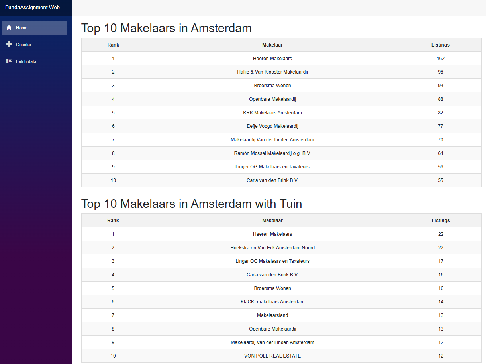

# Funda Assignment

This application calls the Funda API for two queries — Amsterdam listings and Amsterdam listings with a garden (tuin). It fetches all listings for each query, groups them by makelaar and returns the top 10 makelaars with the most listings. Results are displayed in tables in the browser. The solution also includes unit tests for the ranking business logic.


---

## Tech Stack

- .NET 9
- Blazor Server
- xUnit

---

## How to Run

1. Clone the repository
```
git clone https://github.com/marinarismeno/FundaAssignment.git
```

2. If you need a different API key, set it using User Secrets from the FundaAssignment.Web directory
```
dotnet user-secrets set "FundaApi:ApiKey" "your-api-key-here"
```

3. Run the application from the FundaAssignment.Web directory
```
dotnet run
```

4. Your browser will open automatically to localhost

---

## Project Structure

- **FundaAssignment.ApiClient** — Responsible for calling the Funda API, regulating the number of requests and error handling
- **FundaAssignment.Core** — Contains the interfaces for the API client and ranking service, and the models for both the API response and the ranking result
- **FundaAssignment.Tests** — Tests the business logic that happens after all listings are fetched and before they are displayed
- **FundaAssignment.Web** — Combines everything and displays the results in a browser

---

## Design Decisions

- **JSON over XML** — JSON is more commonly used in modern APIs and is easier to work with in C# because `System.Text.Json` is built into .NET, requiring no extra packages.

- **Blazor Server for UI** — Having no prior experience with C# web development, Blazor was chosen because it uses C# instead of JavaScript, making it easier to learn for this assignment. It is also a good fit because data fetching happens server-side, which is where the API calls belong.

- **Separation of concerns** — The solution is split into 4 projects, each with a single responsibility: API communication, business logic, presentation and testing. This makes each layer independently testable, replaceable and scalable.

- **Rate limiting** — The client proactively tracks the number of requests made within a minute and delays when the maximum of 100 requests is reached, avoiding 401 responses from the API.

- **Retry and skip logic** — On `HttpRequestException` (network failures, timeouts) the client waits and retries up to a maximum number of attempts. On `TaskCanceledException` the process stops altogether.

- **API key in User Secrets** — The API key is stored in .NET User Secrets during development to prevent it from being accidentally committed to source control.

- **Flat `IEnumerable<Listing>` from the API client** — Hides pagination complexity from the caller. The ranking service and UI only deal with a simple flat list of listings.

- **Two separate try/catch blocks in the UI** — If one query fails the other result is still displayed rather than losing both tables.

- **`AddTransient` for MakelaarRankingService** — I hadn't used dependency injection lifetimes before. After researching, Transient was the right choice because the service is stateless — it holds no data between calls, so a new instance each time is safe and appropriate.

- **Parallel queries** — Since I had some extra time I tried something new to me: making the two API queries run in parallel using `Task.WhenAll`, hoping to roughly halve the loading time compared to running them sequentially. In practice this reduced the loading time from around 4 minutes to 3 minutes (so 25% faster). The rate limiter was made thread safe using a `lock` to handle concurrent access to the shared request counter and window timer.

---

## Potential Improvements

- **More testing** — the API client could be tested by mocking the `HttpMessageHandler` to simulate rate limiting, retries and error responses without making real HTTP calls.

- **Configurable settings** — max retries and page size are currently hardcoded. Moving them to `appsettings.json` would make the application easier to configure without recompiling.

- **Caching** — storing the results so that refreshing the page does not trigger a full re-fetch every time.

- **Progress indicator** — instead of a simple "Loading..." message, showing how many pages have been fetched out of the total would give the user better feedback and make it clear the application is still working.